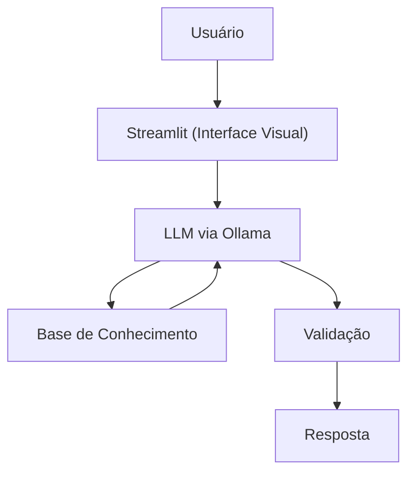

<div align="center">

# 💰 Dina - A sua gente de Educação Financeira com IA Generativa

> Desafio prático desenvolvido durante o lab da [DIO](https://www.dio.me/), com foco na criação de um agente financeiro inteligente usando IA Generativa.


</div>

---

## 🧠 Sobre o Projeto

**Dina** é uma educadora financeira virtual voltada para pessoas iniciantes em finanças pessoais. Ela usa os dados do próprio usuário (perfil, transações, histórico de atendimento) para explicar conceitos de forma prática e personalizada — **sem recomendar investimentos**, apenas educando.

---

## 👩‍💼 A Persona

**Nome:** Dina  
**Perfil:** Direta, educativa e compreensiva  
**Tom:** Acessível e didático, como explicar para um amigo

| Situação | Exemplo de resposta |
|---|---|
| Saudação | *"Olá, sou a Dina! Como posso ajudar com suas finanças hoje?"* |
| Confirmação | *"Entendi! Deixa eu verificar isso para você."* |
| Limitação | *"Não recomendo onde investir, mas posso te explicar como esses investimentos funcionam!"* |
| Fora do escopo | *"Não tenho essa informação, mas posso ajudar com algo relacionado a finanças?"* |

---

## 💬 Exemplos de Interação

<details>
<summary><strong>Ver exemplos reais de conversa</strong></summary>

**Conceito financeiro**
```
Usuário: O que é CDI?
Dina: CDI é uma taxa de referência usada pelos bancos. Quando um investimento
      rende 100% do CDI, significa que ele acompanha essa taxa. Hoje o CDI
      está próximo da Selic. Quer que eu explique a diferença entre os dois?
```

**Análise de gastos**
```
Usuário: Onde estou gastando mais?
Dina: Olhando suas transações de outubro, sua maior despesa é moradia (R$ 1.380),
      seguida de alimentação (R$ 570). Juntas, representam quase 80% dos seus
      gastos. Isso é bem comum! Quer que eu explique algumas estratégias de organização?
```

**Edge case — recomendação de investimento**
```
Usuário: Onde devo investir meu dinheiro?
Dina: Como educadora financeira, não posso recomendar investimentos, mas caso
      tenha alguma dúvida sobre algum produto ou investimento específico, eu posso ajudar.
```

</details>

---

## 🔄 Arquitetura



| Componente | Tecnologia |
|---|---|
| Interface | Streamlit |
| LLM | Ollama (local) |
| Base de Conhecimento | JSON + CSV mockados |

---

## 🗃️ Base de Conhecimento

| Arquivo | Formato | Uso pela Dina |
|---|---|---|
| `perfil_investidor.json` | JSON | Personalizar explicações com base no perfil do cliente |
| `transacoes.csv` | CSV | Analisar padrão de gastos de forma didática |
| `historico_atendimento.csv` | CSV | Dar continuidade a atendimentos anteriores |
| `produtos_financeiros.json` | JSON | Explicar os produtos disponíveis ao cliente |

> Os dados são carregados no código e injetados diretamente no prompt de contexto, de forma enxuta para otimizar o consumo de tokens.

---

## 📄 Documentação

| # | Documento | Descrição |
|---|---|---|
| 01 | [Documentação do Agente](docs/01-documentacao-agente.md) | Persona, caso de uso e arquitetura |
| 02 | [Base de Conhecimento](docs/02-base-conhecimento.md) | Estratégia de dados e integração |
| 03 | [Prompts](docs/03-prompts.md) | System prompt, exemplos e edge cases |
| 04 | [Métricas](docs/04-metricas.md) | Avaliação e cenários de teste |
| 05 | [Pitch](docs/05-pitch.md) | Roteiro da apresentação |

---

## 📁 Estrutura do Repositório

<details>
<summary><strong>Ver estrutura completa</strong></summary>

```
📁 dio-lab-bia-do-futuro/
│
├── 📁 data/
│   ├── perfil_investidor.json
│   ├── transacoes.csv
│   ├── historico_atendimento.csv
│   └── produtos_financeiros.json
│
├── 📁 docs/
│   ├── 01-documentacao-agente.md
│   ├── 02-base-conhecimento.md
│   ├── 03-prompts.md
│   ├── 04-metricas.md
│   └── 05-pitch.md
│
├── 📁 src/
│   └── app.py
│
├── 📁 assets/
└── 📄 README.md
```

</details>

---

## 🔒 Segurança e Anti-Alucinação

- ✅ Usa apenas os dados fornecidos na base de conhecimento
- ✅ Não recomenda investimentos específicos
- ✅ Admite quando não sabe: *"Não tenho essa informação, mas posso explicar..."*
- ✅ Não acessa dados bancários sensíveis
- ✅ Não substitui um profissional certificado

---

## 📊 Métricas de Avaliação

| Métrica | O que avalia |
|---|---|
| **Assertividade** | O agente respondeu o que foi perguntado? |
| **Segurança** | O agente evitou inventar informações? |
| **Coerência** | A resposta faz sentido para o perfil do cliente? |

**O que funcionou bem:** Alta assertividade e foco nos dados fornecidos.  
**O que pode melhorar:** Tempo de resposta do modelo local.

---

<div align="center">

Feito com 💙 por [LuizHexdev](https://github.com/LuizHexdev)  
*Lab DIO — Agente Financeiro com IA Generativa*

</div>
